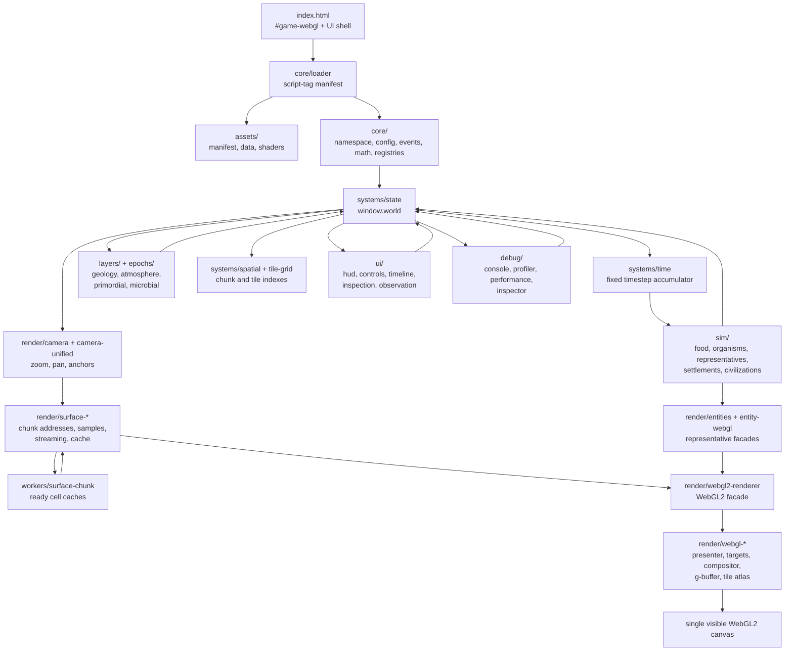

# Pixeldarium Architecture

Date: 2026-06-05

Linear scope: AZR-585. This document describes the current runtime
architecture, not the older planning-only target.

## System Overview

## First-Class Architecture Rules

Pixeldarium follows the mandatory decisions in `AGENTS.md` and the scale model
in `docs/optimization-operating-model.md`.

- Rendering is raw WebGL2 through the visible `#game-webgl` canvas. Canvas2D is
  not a runtime requirement, fallback target, or acceptance path.
- The runtime is vanilla script-tag JavaScript under the `PS.*` namespace. No
  ES modules, runtime packages, CDNs, or build step are required to open
  `index.html` from `file://`.
- Simulation runs on a fixed-timestep accumulator. Rendering consumes the most
  recent world state with interpolation and must not drive simulation ticks.
- Aggregate state is authoritative at planetary scale. Representative
  organisms, entities, and inspection records are watcher-facing facades.
- Chunks are the common render, worker, cache, dirty-region, LOD, and density
  boundary where the system has enough data to align them.
- Generated data crosses worker, asset, shader, GPU, and zoom boundaries only
  through explicit readiness state. The renderer consumes ready or stale data
  rather than blocking on just-requested work.
- LOD preserves what the player can understand at each zoom level. Orbit view
  shows fields and ranges; local view spends detail on terrain materials,
  representative entities, and inspection.
- Packed data must keep explicit range limits. Tile/material IDs, atlas cells,
  variation indices, local chunk coordinates, representative IDs, and layer
  masks need migration plans before their ranges are exceeded.

## Runtime Data Flow

`index.html` creates the single WebGL canvas and static UI shell. It loads
`js/core/namespace.js`, which defines `window.PS` and the ordered script
manifest. `js/core/loader.js` appends each script in order, records loader
state, and crashes loudly on missing scripts.

After the manifest finishes, `startGame()` runs this startup sequence:

1. Load sprite and asset manifest data through `PS.assets.AssetLoader`.
2. Load runtime data from `data/entities.json`, `data/tiles.json`,
   `data/biomes.json`, `data/transitions.json`, `data/particles.json`, and
   `data/animations.json`.
3. Load shader sources from `shaders/` with `.js` sidecar fallback for
   `file://` use.
4. Set up controls, seed the world, reset time, draw the first frame, update
   HUD state, hide the loading screen, then start `requestAnimationFrame`.

Every animation frame, `gameLoop()` asks `PS.time.runFrame()` to execute zero or
more fixed simulation ticks. `updateWorld()` mutates `window.world`; `drawWorld()`
then sends camera, terrain, entity, particle, and UI-facing state through the
render pipeline to the active WebGL2 renderer.

## Module Responsibilities

`core/` owns namespace setup, configuration, assertions, logging, deterministic
math, planet metrics, world-grid helpers, and runtime registries for tiles,
entities, and animation definitions.

`assets/` loads manifests, JSON data, image sheets, and shader text. The loader
tracks startup status so runtime systems can distinguish loaded data from
fallback data.

`systems/` owns the shared `world` object, fixed-time utilities, persistence,
deep-time accounting, object pools, spatial indexes, and the tile grid.

`sim/` owns mutation of world state: food growth, organism behavior and traits,
aggregate representative summaries, settlements, civilization progression,
modifiers, and simulation-facing worker helpers.

`render/` owns camera state, LOD classification, globe projection, surface
sampling and streaming, terrain material classification, draw ordering,
particles, entity atlas lookup, sprite batching, and the active WebGL2
presentation stack.

`layers/` owns always-on environmental layers such as geology and atmosphere.
They run across epochs and feed long-lived world fields rather than a separate
era-specific render path.

`epochs/` owns epoch registration and epoch-specific systems such as primordial
and microbial simulation. Epoch systems register through the epoch registry and
do not bypass the shared world state.

`ui/` owns controls, HUD text, menus, timeline, spotlight, observation overlay
controls, inspection display, notifications, and touch interaction. UI reads
world summaries and emits user intent back into shared state.

`debug/` owns diagnostic overlays, profiler output, console commands,
performance display, and inspector text. Debug code reports evidence but does
not become the source of truth for simulation behavior.

`workers/` contains worker entry points. The active surface worker lifecycle is
driven from `render/surface-worker-client.js`; generated chunks must be
promoted only after a ready payload is available.

`data/` contains runtime JSON and JSON-sidecar sources for entities, tiles,
biomes, transitions, particles, and animations.

`shaders/` contains file-backed WebGL2 shader sources plus `.js` sidecars used
when direct file fetch is unavailable.

`tests/` contains Node-based source, manifest, architecture, and behavior
checks. Browser smoke tests are used for rendered WebGL evidence.

## Key Abstractions

`window.world` is the shared runtime state. Simulation systems mutate it,
rendering reads it, UI presents it, and persistence serializes it.

`PS.time` is the decoupled accumulator. It runs fixed simulation ticks at the
configured timestep and records render/update timing.

`PS.pools` stores mass entities in typed arrays with facade objects for current
runtime compatibility. Organisms use struct-of-arrays fields for position,
energy, movement, lineage, species, population, representative IDs, and traits.

`PS.tileGrid` is an intrusive tile spatial index backed by typed arrays. It
keeps tile-local linked lists for O(1) insert, remove, and move operations.

`PS.sim.representatives` maintains aggregate biology population summaries and
watcher-facing representative records. Aggregate population state is the scale
boundary; selected or pinned representatives receive full detail refresh.

`PS.camera` and `PS.camera.unified` keep zoom, pan, canvas-to-world conversion,
zoom anchoring, and LOD band classification aligned for input and rendering.

`PS.render.pipeline` is the layered render loop. It registers layers, assigns
draw order, filters by zoom band and LOD tier, and publishes frame statistics.

`PS.render.surfaceRender` is the surface chunk lifecycle. It tracks cache,
pending, dirty, placeholder, generated, evicted, and stats boundaries for local
surface rendering.

`PS.render.surfaceWorker` builds chunk cell payloads asynchronously. The main
thread consumes ready `cellCache` data and skips pending chunks.

`PS.render.surfaceTileWebgl` converts ready surface cells into atlas-page WebGL2
batches. The current path is a transitional instanced atlas path, not the final
single data-texture shader.

`PS.render.webglEngine` owns the shared WebGL2 context, targets, textures, and
upload helpers. `PS.render.webglPresenter` owns direct presentation to the
single visible canvas.

`PS.render.WebGL2Renderer` is the active renderer facade. Terrain, entity,
particle, shadow, light, and sprite submissions go through it so render stats
and future renderer swaps have one boundary.

`PS.ranmap` provides deterministic per-tile visual randomization for atlas
variation without allocating random objects during iteration.

## Rendering And Streaming Boundary

Surface rendering is chunk-addressed. A chunk address includes the zoom level,
sample meters, chunk sample size, and chunk coordinates. Chunk keys are reused
by the cache, worker requests, dirty invalidation, and WebGL2 consumption.

Chunk lifecycle states are represented by cache collections and payload fields:

- requested or pending: present in `pendingChunks` or worker `pending`.
- ready: completed payload has `readyState: "ready"` and `cellCache`.
- promoted: stored in the chunk cache and ordered for reuse.
- stale or dirty: marked in `dirtyChunks` or replaced by newer cache entries.
- evicted: removed when the cache limit is exceeded.
- failed: recorded in worker failure counters and runtime errors.

The player-perception contract is stable zoom and motion. While new terrain
work is pending, the renderer keeps drawing the newest ready chunk or skips the
missing chunk instead of blocking the frame. Local zoom spends detail on
material families, atlas variation, and representative entities; orbit and
region zooms preserve broad fields, ranges, and event understanding.

## Threading Model

Simulation currently runs on the main thread through the fixed accumulator.
Surface chunk preparation can run through a Web Worker when the browser supports
`Worker`, `Blob`, and `URL`. The worker returns transferable buffers and ready
cell metadata; the main thread owns promotion, cache eviction, and WebGL2 upload.

`workers/sim-worker.js` exists as a future worker entry point, but it is not the
authoritative simulation loop today. Moving simulation off the main thread must
preserve fixed timestep semantics, readiness state, and aggregate state
ownership.

## Initialization Order

1. Browser parses `index.html` and creates `#game-webgl`, UI elements, loading
   screen, and debug-output error box.
2. `namespace.js` defines `window.PS`, runtime error capture, and the script
   manifest.
3. `loader.js` validates and loads every manifest script in order.
4. `main.js` waits for `PS.core.loaderPromise` and calls `startGame()`.
5. Startup assets, data, and shaders load. Data registries and shader manager
   readiness are recorded.
6. Controls are bound, world state is seeded, typed-array pools and tile grid
   reset, RANMAP and particle definitions initialize, and always-on layers and
   epochs prepare their state.
7. The first `drawWorld()` call initializes the WebGL2 presenter and renderer
   stack, draws a nonblank frame, and updates UI state.
8. The loading screen hides and `requestAnimationFrame(gameLoop)` begins.
9. Each frame runs fixed simulation ticks, renders if needed, records timing,
   and updates HUD/debug surfaces on cadence.

## Encoding Limits And Migration Risks

- Tile IDs, material IDs, atlas pages, atlas cells, variations, and flags must
  stay within the packed values consumed by WebGL2 shader and atlas paths.
- Surface chunk local coordinates are bounded by configured chunk samples and
  tile size. Increasing them changes worker payload size, cache pressure, and
  upload cost.
- Representative, population, species, settlement, and civilization IDs are
  numeric runtime IDs. Persistence migrations must preserve stable IDs before
  increasing ranges or changing ownership.
- Data-texture work must document byte layout and maximum layer count before it
  replaces the transitional instanced atlas path.
- Any system that mutates aggregate population identity or trait distributions
  outside normal counters must invalidate representative refresh signatures.

## Verification Expectations

Architecture changes should be verified with the narrowest relevant checks:

- `npm test`
- `npm run build`
- `git diff --check`
- `node tests/no-canvas2d-source.test.js`
- `rg -n "agent-studio|tools/agent-studio" index.html js`
- Browser file-open smoke for rendered UI, console errors, input, and nonblank
  WebGL pixels when rendering behavior changes.

For rendering, streaming, mass simulation, performance, or observation changes,
implementation notes must state the bottleneck, representation or lifecycle
boundary, chunk/batch/aggregate boundary, readiness rule, player-perception
contract, new constraint or encoding limit, and the metric that proves the
bottleneck moved.
