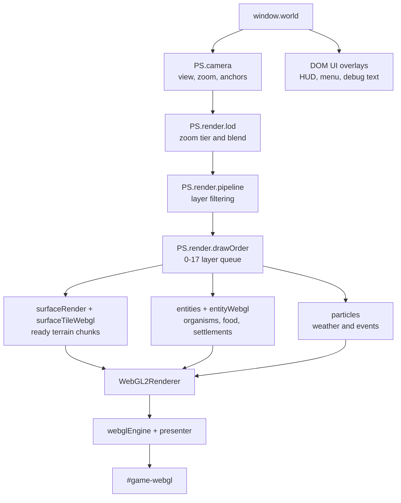

# Pixeldarium Rendering

Date: 2026-06-05

Linear scope: AZR-586. This document describes the current WebGL2 rendering
pipeline and the next-step constraints for the visual stack.

## Pipeline Stages



The active production path is raw WebGL2. The runtime uses one visible canvas:
`#game-webgl`. Canvas2D is not a renderer, fallback, copy-back target, or
acceptance path.

The draw-order layer table is defined in `js/render/draw-order.js`:

| Order | Layer |
| --- | --- |
| 0 | `TERRAIN_BASE` |
| 1 | `TERRAIN_TRANSITION` |
| 2 | `TERRAIN_DECORATION` |
| 3 | `WATER_SURFACE` |
| 4 | `SHADOW` |
| 5 | `ENTITY_GROUND` |
| 6 | `VEGETATION_TRUNK` |
| 7 | `ENTITY_SORTED` |
| 8 | `VEGETATION_CANOPY` |
| 9 | `BUILDING_WALL` |
| 10 | `BUILDING_ROOF` |
| 11 | `PARTICLE_BELOW` |
| 12 | `WEATHER` |
| 13 | `ROUTE_OVERLAY` |
| 14 | `SELECTION_OVERLAY` |
| 15 | `DEBUG_OVERLAY` |
| 16 | `UI_WORLD` |
| 17 | `UI_SCREEN` |

`ENTITY_SORTED` commands are sorted by `sortY`, `screenY`, or entity `y` before
flush. Other layers flush in numeric order.

## Runtime Stage Responsibilities

Terrain rendering builds chunk addresses from the camera and surface LOD. Ready
chunk payloads provide `cellCache` arrays. `PS.render.surfaceTileWebgl` converts
those cells to atlas instances grouped by atlas page and draws each page with
`gl.drawArraysInstanced(gl.TRIANGLE_STRIP, 0, 4, instanceCount)`.

Surface features are currently represented through terrain material families,
subcell variation, atlas selection, and future layer slots such as
`TERRAIN_DECORATION`, `VEGETATION_TRUNK`, and `VEGETATION_CANOPY`.

Entity sprites are watcher-facing facades for organisms, food, settlements, and
future civilization actors. `PS.render.entityWebgl` and `PS.atlas` provide the
current WebGL2 entity path.

Shadows, particles, routes, selections, debug overlays, and screen UI have
dedicated draw-order slots. Some slots are architecture-ready before every
visual family has a full production renderer.

G-buffer support lives in `js/render/webgl-gbuffer.js`. It creates albedo,
normal/height, and depth/stencil attachments for local rendering experiments
and downstream lighting/atmosphere work.

DOM UI overlays remain outside the WebGL draw stack. HUD, panels, menu,
timeline, debug text, and the loading screen are HTML/CSS surfaces layered over
the WebGL canvas.

## Coordinate Systems

Pixeldarium uses four active coordinate systems.

World coordinates are planet-relative logical positions. For global and surface
work, this usually means latitude/longitude. `PS.camera.unified.latLonToWorld()`
maps latitude/longitude to `worldX/worldY`; `worldToLatLon()` reverses it.

Tile coordinates are integer grid positions on the current world grid. Tile X
wraps around the planet and tile Y clamps at the poles. `tileToWorld()` and
`worldToTile()` convert between tile and world positions.

Screen coordinates are pixels on `#game-webgl`. `clientToScreen()` maps DOM
pointer coordinates to canvas pixels. `latLonToScreen()`,
`worldToScreen()`, `screenToLatLon()`, and `screenToWorld()` are the main
camera conversion functions for input and rendering.

UV coordinates are normalized texture coordinates for atlas lookup. Atlas cells
store `u0/v0/u1/v1`. The terrain tile shader mixes `a_uvRect.xy` and
`a_uvRect.zw` from the instance corner; the sprite shader splits an atlas cell
into diffuse and normal/height halves for future lighting.

Surface meters are an intermediate camera representation. `getSurfaceMeters()`,
`surfaceMetersToScreen()`, and `screenToSurfaceMeters()` preserve smooth
Google-Earth-style pan and zoom across latitude-dependent longitude scale.

## Zoom Bands

Configured zoom anchors live in `CONFIG.PLANET_ZOOM_LEVELS`:

| Index | Name | Meters per sample | Chunk size |
| --- | --- | ---: | ---: |
| 0 | Globe | 125000 | 4000 km |
| 1 | Continent | 25000 | 1000 km |
| 2 | Region | 5000 | 200 km |
| 3 | Area | 1000 | 40 km |
| 4 | Landscape | 100 | 4 km |
| 5 | Detail | 25 | 1 km |
| 6 | Ground | 5 | 0.25 km |
| 7 | Meter | 1 | 0.25 km |

`PS.render.pipeline.getZoomBand()` classifies the user-facing bands from the
normalized `PS.render.lod` architecture zoom. The configured camera currently
has eight anchor stops, but those stops cover the full architecture-zoom range
from broad globe view to meter-scale ground inspection.

| Architecture zoom | Band | Perception contract |
| --- | --- | --- |
| `< 3` | orbit | Globe, broad fields, markers, no local detail dependency. |
| `3-5.999` | planet | Surface projection and coarse range understanding. |
| `6-9.999` | continent | Chunked terrain and large material families. |
| `10-14.999` | region | Local surface chunks, territory, pressure, selected detail. |
| `15-18.999` | local | Rich terrain materials and representative entities. |
| `>= 19` | settlement | Building-scale and watcher-facing detail slots. |

`PS.render.lod` maps the same zoom to architecture tiers `galaxy`, `planet`,
`continent`, `region`, and `local` using a normalized 1-20 architecture zoom.
LOD transitions expose blend windows so adjacent tiers can overlap instead of
popping.

## Atlas System

`PS.atlas` is the current runtime atlas. It uses a 256x256 RGBA page with
16-pixel default cells and explicit cell records:

```text
name, pageIndex, x, y, w, h, u0, v0, u1, v1
```

Organism trait cells are allocated as 32x16 records: the left half is diffuse
color and the right half stores normal/height placeholder data. The atlas can
allocate additional 256x256 RGBA pages when authored terrain/entity cells exceed
the current page capacity; renderers already batch by page index. Terrain
material cells are selected from tile and biome data, cached on ready chunk
cells as `terrainAtlasCell`, and reused until the chunk or registry changes.

`PS.render.surfaceTileWebgl` groups terrain instances by atlas page. Ready
chunk cells are appended into pooled growable `Float32Array` page buffers, then
finalized into typed upload ranges before WebGL submission. Each terrain
instance currently packs 10 floats:

```text
screenX, screenY, width, height, u0, v0, u1, v1, alpha, flipH
```

The configured terrain upload limit is
`CONFIG.PLANET_SURFACE_TILE_WEBGL_MAX_INSTANCES`, currently 8192 instances per
upload segment. Larger visible batches are split into multiple page draws.

`PS.spriteBatch` supports up to 16384 sprite instances. Each sprite instance
packs 12 floats:

```text
worldX, worldY, u0, v0, u1, v1, tintR, tintG, tintB, tintA, scale, flipH
```

This is not the final AZR-383 single data-texture tilemap. The current terrain
path is a transitional instanced atlas renderer that keeps WebGL2 ownership of
pixel throughput while the data-texture shader work is prepared.

Settlement readiness facades are pre-settlement watcher markers. They are
derived from aggregate lineage active/peak population progress, capped by
`CONFIG.PLANET_SETTLEMENT_READINESS_MAX_MARKERS`, and stop once authoritative
settlement aggregates exist. Readiness atlas cells own their authored color and
use neutral sprite tint, so the entity shader does not multiply lineage color
twice. They do not create or persist settlements.

## Shader Reference

Shader sources are loaded from `shaders/` by `PS.render.shaderManager`.
`file://` support is preserved by `.js` sidecars when direct text fetch is not
available.

| Shader | Files | Purpose |
| --- | --- | --- |
| `sprite-batch` | `sprite-batch.vert`, `sprite-batch.frag` | Instanced sprite quads with atlas UVs, tint, scale, and horizontal flip. |
| `terrain-tile` | `terrain-tile.vert`, `terrain-tile.frag` | Instanced terrain atlas quads from ready surface cells. |
| `gbuffer-compose` | `gbuffer-compose.vert`, `gbuffer-compose.frag` | Full-screen source texture compose pass. |
| `gbuffer-terrain` | `gbuffer-terrain.vert`, `gbuffer-terrain.frag` | Writes material albedo and normal/height data into local G-buffer attachments. |
| `globe-sphere` | `globe-sphere.vert`, `globe-sphere.frag` | Samples terrain and overlay textures onto an interactive globe projection. |
| `surface-chunk` | `surface-chunk.vert`, `surface-chunk.frag` | Surface chunk shader slot for chunk rendering experiments. |
| `entity-atlas` | `entity-atlas.vert`, `entity-atlas.frag` | Entity atlas rendering path for organisms and other facades. |
| `shadow` | `shadow.vert`, `shadow.frag` | Shadow rendering slot. |
| `particle` | `particle.vert`, `particle.frag` | Particle and weather rendering slot. |

Shader compile failures are loud. `ShaderManager.compile()` records fallback
errors in `PS.runtime` and uses a magenta fallback program only as a visible
failure signal.

## Performance Budget

The target frame budget is 16ms. AZR-586 uses this practical split:

| Work | Target |
| --- | ---: |
| Simulation update | 4 ms |
| Terrain render and upload | 4 ms |
| Entity, particle, and overlay render | 4 ms |
| Compose, UI cadence, and overhead | 4 ms |

Relevant current limits:

- Surface streaming frame budget: `CONFIG.PLANET_SURFACE_STREAMING_FRAME_BUDGET_MS = 4`.
- Particle render budget: `CONFIG.PARTICLE_RENDER_BUDGET_MS = 2`.
- Simulation catch-up cap: `CONFIG.MAX_SIM_UPDATES_PER_FRAME = 3`.
- Frame budget history: `CONFIG.FRAME_BUDGET_HISTORY_LIMIT = 120`.
- Close-band ready surface chunks:
  `CONFIG.PLANET_SURFACE_CLOSE_VISIBLE_CHUNK_LIMIT = 192`.
- Terrain instances per upload segment: `CONFIG.PLANET_SURFACE_TILE_WEBGL_MAX_INSTANCES = 8192`.
- Local ecology terrain encoding: enabled with
  `CONFIG.PLANET_SURFACE_ECOLOGY_ENABLED`, starts at
  `CONFIG.PLANET_SURFACE_ECOLOGY_MIN_ZOOM = 4`, and samples a bounded
  `CONFIG.PLANET_SURFACE_ECOLOGY_RADIUS_TILES = 16`.
- Active ecology microstructure: generated inside the existing 16x16 terrain
  atlas cell after organic/nutrient pressure is known. It adds no new draw-call
  family and uses only the existing food/organism pressure buckets plus a
  bounded `ecoform.0..3` sub-tile phase.
- Entity instances: `CONFIG.PLANET_ENTITY_WEBGL_MAX_INSTANCES = 8192`.
- Watched representative intent markers: `CONFIG.PLANET_REPRESENTATIVE_INTENT_MAX_MARKERS = 128`.
- Active particle cap: `CONFIG.PARTICLE_MAX_ACTIVE = 10000`.

Renderer stats are available through `PS.render.renderer.getStats()`. Key fields
include `drawCalls`, `tilemapDraws`, `tilemapWebglDraws`, `tilemapFallbacks`,
`terrainDraws`, `terrainPageDraws`, `entityDraws`, `intentEntityDraws`,
`rendererGpuFrameMs`, `overBudget`, `singleVisibleCanvas`, and
`directPresentsThisFrame`.
Frame budget stats are available through
`PS.debug.performance.getFrameStats()`, including sim, render, overhead, total,
over-budget, and dropped catch-up frame counts.

## Readiness And LOD Contract

Rendering consumes ready data. Surface chunks must be completed and carry a
ready `cellCache` before `surfaceTileWebgl` draws them. Pending chunks stay in
the worker/cache lifecycle and must not block the frame.

Local and settlement bands use a bounded ready-chunk working set. Candidate
chunks are sorted by screen priority and pan direction, then capped by
`PLANET_SURFACE_CLOSE_VISIBLE_CHUNK_LIMIT` before terrain atlas instances are
submitted. This preserves center-footprint detail and keeps lower-priority edge
chunks deferred instead of submitting every visible candidate each frame.

Local ecology material encoding is a render facade over current organism and
food buckets. It does not make visible organisms or food particles
authoritative; it derives bounded `organic.0..3` and `nutrient.0..3` terrain
atlas suffixes from current ready samples and current bucket pressure. Active
ecology microstructure is drawn inside those ready atlas cells so close zoom
reads as living terrain instead of one broad material wash. The microstructure
phase is bounded to `ecoform.0..3`; it is deterministic by sample coordinate
and is part of the terrain atlas cache key.

At orbit zoom, the renderer preserves global comprehension: globe shape,
terrain fields, overlays, and event markers. At local zoom, it spends detail on
terrain material families, atlas variation, representative organisms, and
inspection. The system should prefer stable perceptual detail over literal
full-resolution truth everywhere.

## Rendering Change Gate

For any future rendering, streaming, observation, or performance change, record:

- bottleneck targeted,
- representation or lifecycle boundary changed,
- chunk, batch, or aggregate boundary used,
- readiness state required before data is consumed,
- player-perception contract preserved,
- new constraint or encoding limit introduced,
- metric proving the bottleneck moved.

For current rendering work, the important constraints are: WebGL2 owns
production pixel throughput, chunks align render/worker/cache/LOD boundaries,
and Canvas2D remains outside the runtime.
